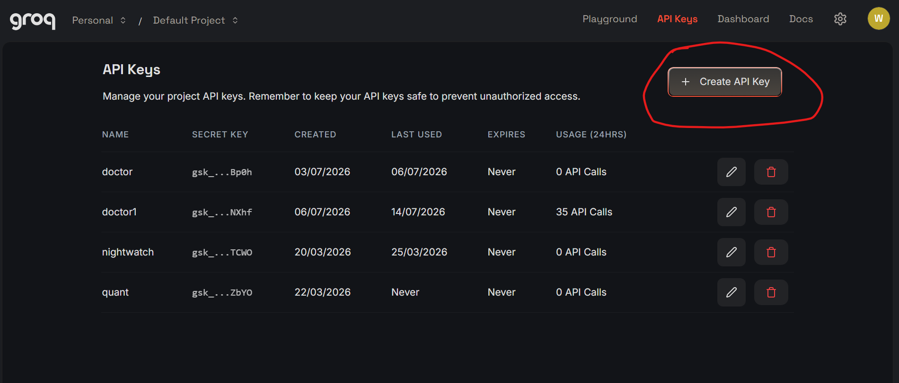

# DOCTOR

A terminal app written in Python, made to help users diagnose and fix lagging Windows computers by analyzing system logs and safely matching issues to a command database.

## Features
- **System diagnosis**: An AI report based on the `Get-WinEvent -LogName System -MaxEvents 150` command.
- **Safe command execution**: After the report is generated and analyzed, the commands to run are derived based on a curated command database to ensure that the AI does not propose any invasive commands.
- **Conditional feedback loop**: In the command database, each command is assigned some variables. Because of this, after running certain commands, another report will generate or the user will have to make some additional decisions in the terminal

## Setting it up your own machine
Make sure you have Python 3.10 and Git installed on your machine.

1. Clone the repo by running these commands in your IDE's Bash terminal:
```git clone [https://github.com/yourusername/system-doctor.git](https://github.com/yourusername/system-doctor.git)```
```cd system-doctor```
2. Install Groq by running this command in the Bash terminal (you can also use another AI, but certain pieces of code will need to be changed):
```pip install groq```
3. Create an API key, go on this website click create API key



name yor key, submit and than copy it

4. Create a file "API.txt", and paste there your key, (do not put it in a varible or anything only key)

**Running it on your machine**
1. open the windows powershell and run this command (substicise the "Lenovo with your computer's producer): 
```cd C:\Users\Lenovo\Desktop\doctor```
2. run:
```python main.py```

**DISCLAIMER**
This tool is not fully debuged and tested yet so I recomend only using the 1. Diagnose system 2. Diagnose and Treat issues features.


